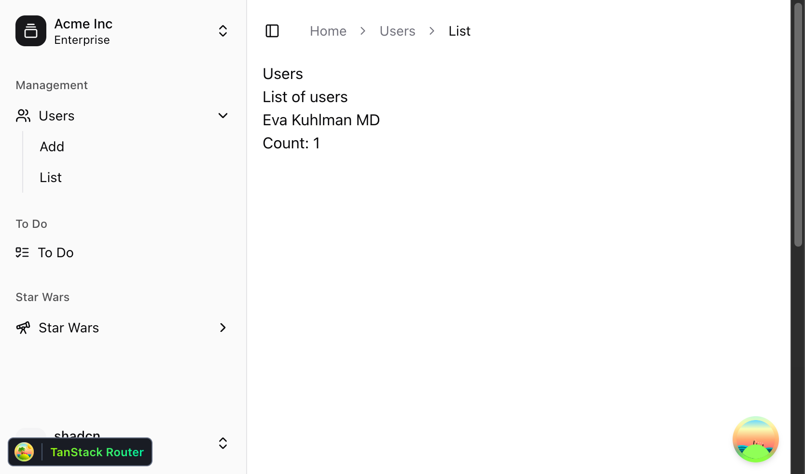

# Fullstack Hackathon Starter Monorepo



This monorepo is designed for rapid fullstack development, featuring a modern tech stack and best practices for scalable, maintainable apps.


## 🚀 Features

- **Turborepo**: Fast monorepo build system with local and remote caching.
- **Backend**: [NestJS](https://nestjs.com/) API with PostgreSQL, Prisma ORM, and Zod validation.
- **Frontend**: [TanStack Router](https://tanstack.com/router) React app with [TanStack Query](https://tanstack.com/query) for data fetching.
- **API Contracts**: [ts-rest](https://ts-rest.com/) for end-to-end type-safe API contracts and clients.
- **UI Library**: Shared component library using [shadcn/ui](https://ui.shadcn.com/) and Tailwind CSS.
- **TypeScript**: End-to-end type safety across all apps and packages.
- **ESLint & Prettier**: Consistent code style and linting across the repo.
- **Docker Compose**: Easy local development with PostgreSQL.

---

## 🗂️ Monorepo Structure

```
apps/
  backend/    # NestJS API (Node.js, Prisma, PostgreSQL)
  frontend/   # React app (TanStack Router, TanStack Query)
packages/
  api-contracts/   # ts-rest API contracts (shared types)
  eslint-config/   # Shared ESLint config
  typescript-config/ # Shared tsconfig
  ui/              # Shared React UI components
```

---

## 🛠️ Getting Started

### 1. Clone the repository

```bash
git clone https://github.com/rasouza/fullstack-hackathon-starter
cd fullstack-hackathon-starter
```

### 2. Install dependencies

```bash
npm install
```

### 3. Start the database with Docker Compose

```bash
docker compose up -d
```

This will start a local PostgreSQL instance.

### 4. Setup the database

```bash
cd apps/backend
cp .env.example .env
npm run db:generate      # Generate Prisma client
npm run db:migrate       # Run migrations
npm run db:seed          # Seed the database with sample data
```

### 5. Run the backend (NestJS API)

```bash
npm run start:dev
```

The backend will be available at [http://localhost:3001](http://localhost:3001).

A OpenAPI spec is available at [http://localhost:3001/docs](http://localhost:3001/docs)

### 6. Run the frontend (React app)

Open a new terminal:

```bash
cd apps/frontend
npm run dev # or npm run start
```

The frontend will be available at [http://localhost:3000/dashboard](http://localhost:3000/dashboard).

---

## 🧩 Highlights

- **Type-Safe API**: API routes and clients are generated from a single source of truth using ts-rest and Zod.
- **Modern Routing**: File-based routing and layouts with TanStack Router.
- **Data Fetching**: Integrated TanStack Query for React Query patterns.
- **Component Library**: Reusable UI components with shadcn/ui and Tailwind CSS.
- **Prisma ORM**: Type-safe database access and migrations.
- **Environment Validation**: Zod-powered env validation for both frontend and backend.
- **Devtools**: Built-in devtools for TanStack Router and Query.

---

## 🧪 Testing

### Backend

```bash
cd apps/backend
npm test
npm test:e2e
```

### Frontend

```bash
cd apps/frontend
npm test
```

---

## 📦 Useful Commands

- **Build all apps/packages:**  
  `turbo build`
- **Develop all apps/packages:**  
  `turbo dev`
- **Lint all code:**  
  `turbo lint`
- **Format all code:**  
  `turbo format`

---

## 📚 Resources

- [Turborepo Docs](https://turborepo.com/docs)
- [NestJS Docs](https://docs.nestjs.com/)
- [TanStack Router Docs](https://tanstack.com/router)
- [TanStack Query Docs](https://tanstack.com/query)
- [ts-rest Docs](https://ts-rest.com/)
- [Prisma Docs](https://www.prisma.io/docs/)
- [shadcn/ui Docs](https://ui.shadcn.com/)
